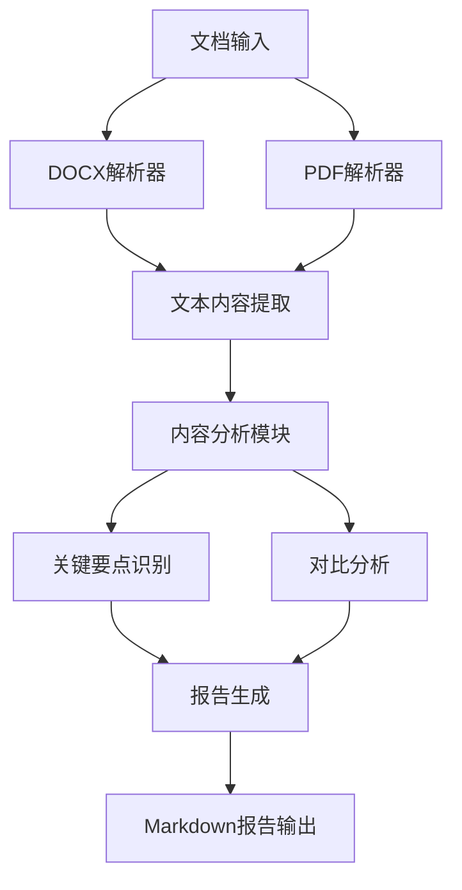

## 用户需求

分析营销短信供应商管理文件夹中的两份文档，提取并总结短信供应商管理的核心要点

## 产品概述

针对企业短信供应商管理的文档分析工具，能够处理DOCX和PDF格式文件，提取关键管理条款和规范，形成结构化的管理要点总结

## 核心功能

- 解析DOCX和PDF格式的管理办法文档
- 提取供应商管理的关键条款和要求
- 对比分析两份文档的异同点
- 生成结构化的管理要点总结报告

## 技术栈选择

- **文档处理**: Python + python-docx (DOCX) + PyPDF2/pdfplumber (PDF)
- **文本分析**: 正则表达式 + 自然语言处理
- **报告生成**: Markdown格式输出

## 实现方案

### 高层策略

采用Python脚本方式处理二进制文档文件，通过专门的文档解析库提取文本内容，然后进行结构化分析和对比

### 关键技术决策

- **文档解析**: 使用python-docx处理DOCX文件，使用pdfplumber处理PDF文件（相比PyPDF2有更好的文本提取效果）
- **内容分析**: 基于关键词匹配和段落结构识别管理要点
- **对比分析**: 通过文本相似度和关键词差异分析两份文档的异同

## 实现细节

### 性能考虑

- 文档大小通常不大，无需考虑内存优化
- 重点关注文本提取的准确性和完整性

### 错误处理

- 文档格式损坏的异常处理
- 编码问题的处理
- 提取失败时的降级方案

## 架构设计

### 系统架构

采用模块化设计，包含文档解析模块、内容分析模块和报告生成模块



### 模块划分

- **文档解析模块**: 负责DOCX和PDF文件的文本提取
- **内容分析模块**: 识别管理要点、条款结构
- **对比分析模块**: 分析两份文档的差异和共同点
- **报告生成模块**: 生成结构化的分析报告

## 目录结构

```
项目根目录/
├── document_analyzer.py     # [NEW] 主分析脚本，包含文档解析、内容分析和报告生成功能
├── 短信供应商管理要点总结.md  # [NEW] 生成的分析报告文件
└── 营销短信供应商管理/      # [EXISTS] 包含待分析的DOCX和PDF文件
    ├── 「隐藏计算逻辑」2025企业短信供应商管理办法-生态合作部(修订中V1.7).docx
    └── 腾讯企业短信供应商管理办法.pdf
```

## 关键代码结构

### 文档解析接口

```python
class DocumentAnalyzer:
    def extract_docx_content(self, file_path: str) -> str
    def extract_pdf_content(self, file_path: str) -> str
    def analyze_content(self, content: str) -> dict
    def compare_documents(self, doc1_content: str, doc2_content: str) -> dict
    def generate_report(self, analysis_results: dict) -> str
```

## 代理扩展

### SubAgent

- **code-explorer**
- 目的: 探索现有代码结构，查找是否有类似的文档处理模式可以复用
- 预期结果: 识别现有项目中的文档处理方法和最佳实践