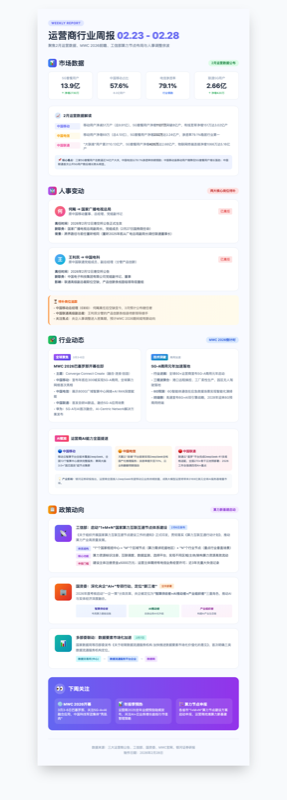

# 行业洞察 · 运营商信息周报

> 已上线 · 连续产出5期

---

## 现状痛点

| # | 痛点 | 说明 |
|---|------|------|
| 1 | **信息碎片化** | 10+渠道，人工收集 **4-6h/周** |
| 2 | **时效性差** | 关键信息滞后 **3-5天** |
| 3 | **缺乏结构化** | 零散信息难形成系统洞察 |
| 4 | **分发低效** | 口头同步，团队认知不齐 |

---

## AI + CodeBuddy Skill 自动化方案

```
指令触发 ▶ AI联网采集 ▶ 模板渲染 ▶ 多渠道分发
```

---

## 实现价值

| 指标 | 数据 | 说明 |
|------|------|------|
| **效率提升** | **98%** | 4-6h → 5min |
| **结构化覆盖** | **4维** | 市场·人事·行业·政策 |
| **一键分发** | **3端** | 网页·邮件·图片 |
| **稳定产出** | **5期** | 11人周覆盖 |

---

## 周报效果展示

> 最新一期 02.23-02.28 | GitHub Pages 在线归档


